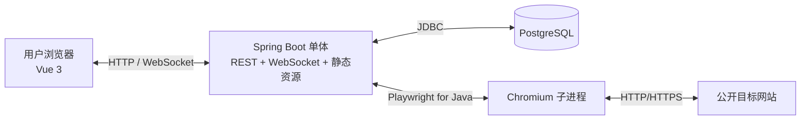
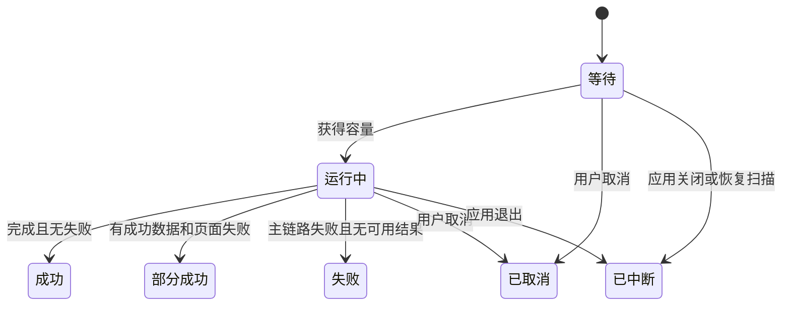

# 可视化网页采集架构

## 1. 架构目标

本架构服务于 [`product-spec.md`](./product-spec.md) 定义的首版范围，优先级依次为：

1. 维护者能够使用熟悉的 Java/Spring Boot 长期维护。
2. 单个 JAR 可在 Windows 和 Linux 上直接运行。
3. 远程浏览器、采集执行和 Web 请求在同一应用内保持清晰隔离。
4. 模块 interface 足够窄，后续 AI Coding 可以按里程碑局部实现和验证。
5. 在 10 个账号、3 个并行运行的目标容量内保持可解释与可恢复。

已接受的关键决策：

- [ADR-0001：使用服务端远程浏览器支持零安装采集](./adr/0001-use-server-side-remote-browser.md)
- [ADR-0002：使用单个 Spring Boot 服务部署应用](./adr/0002-use-single-spring-boot-deployment.md)
- [ADR-0003：单体内按业务能力组织深模块](./adr/0003-organize-code-by-business-module.md)

## 2. 系统形态

### 2.1 单一部署单元

- 后端为 Java + Spring Boot。
- 前端为 Vue 3 + TypeScript + Vite。
- Vue 构建产物进入 Spring Boot 静态资源目录，最终发布一个可执行 JAR。
- Spring Boot 内置 Web 容器直接提供 HTTP、REST、WebSocket 和静态资源。
- PostgreSQL 是唯一外部基础设施。
- 不依赖 Docker、Nginx、Redis、消息队列、Elasticsearch 或对象存储。

首版建议使用 Maven Wrapper 统一 Java 构建，根构建负责先构建前端再打包后端。具体 JDK、Spring Boot、Vue 和 Playwright 版本在 M1 选择并锁定，不在架构文档中追逐“最新版”。

### 2.2 运行进程

Spring Boot 与 Playwright driver 运行于同一 JVM 管理范围，Chromium 由 Playwright 启动为独立子进程。API、配置会话和正式采集仍共享 JVM，因此必须通过专用执行器、容量限制和资源回收保护 Web 请求线程。

## 3. 深模块与 interface

代码按业务能力组织。模块是一个 interface 加隐藏在其后的实现；Controller、数据库代码和 Playwright 代码不是系统级横向层。

### 3.1 `identity`

职责：账号、角色、登录会话和所有权检查。

建议 interface：

- `AccountAdministration`：创建账号、停用账号、重置密码。
- `IdentityAccess`：取得当前身份并判断其能否访问某个领域对象。

模块内部隐藏 Spring Security、BCrypt、CSRF 和会话 Cookie 配置。其他模块接收已经认证的 `ActorId`，不自行读取 SecurityContext。

### 3.2 `task`

职责：采集任务草稿、校验、可运行状态和任务快照。

建议 interface：

- `TaskCatalog`：创建、读取、保存草稿和列出任务。
- `TaskReadiness`：返回结构化校验结果。
- `TaskSnapshotFactory`：为一次运行生成不可变快照。

任务定义采用带 `schemaVersion` 的 JSON 结构保存，包含采集模式、入口 URL、字段、定位规则、导航、等待、限制和去重定义。模块必须保证：无法绕过校验直接创建可运行任务；运行只能取得已经固化的快照。

### 3.3 `visualbrowser`

职责：远程 Chromium 配置会话、画面帧、输入事件、浏览/选择模式和元素定位。

建议外部 interface：

- `VisualSessionManager`：打开、查询和关闭当前用户的配置会话。
- `VisualSessionChannel`：接收输入命令，输出画面帧、页面状态和元素检查结果。

Playwright 是真实外部依赖，因此在模块内部设置 seam：

- 生产 adapter：`PlaywrightVisualBrowserAdapter`。
- 测试 adapter：确定性的内存/fixture adapter，用于验证会话状态、权限、超时和协议，而无需真实 Chromium。

Playwright 对象及线程约束不得暴露到模块 interface。

### 3.4 `extraction`

职责：定位规则校验、字段提取、清洗、重复列表推断和预览。

建议 interface：

- `DefinitionValidator`：对任务定义返回结构化错误，不抛出笼统异常。
- `ExtractionPreview`：给定定义和受限预览预算，返回结果记录与字段诊断。
- `PageExtractor`：在当前页面提取单页或一个列表项的扁平结果。

系统生成 CSS/XPath、相对列表字段、正则清洗和类型转换全部隐藏在该模块内。预览和正式运行必须调用相同的提取实现，避免出现“预览能用、运行失败”的双套逻辑。

### 3.5 `run`

职责：创建运行、排队、容量控制、执行、重试、取消、中断恢复和进度。

建议 interface：

- `RunCoordinator`：从任务创建运行、取消运行、查询进度。
- `RunRecovery`：启动时处理中断的遗留运行。

`RunCoordinator` 隐藏队列、线程、浏览器生命周期和状态迁移。调用方只观察运行 ID、状态、进度和结构化失败。

### 3.6 `result`

职责：追加结果、运行内去重、分页查询、流式导出和到期清理。

建议 interface：

- `RunResultSink`：批量追加本次运行的结果与错误。
- `RunResultQuery`：分页读取结果与汇总统计。
- `RunExport`：向输出流写入 CSV 或 JSON。
- `RetentionCleanup`：删除已到期运行及关联数据。

导出直接写 HTTP 响应流，不在磁盘生成临时完整文件。

### 3.7 seam 纪律

- 模块 interface 是调用方与测试共同使用的表面。
- 不为每个类机械创建 port；只有真实变化点才创建 seam。
- Playwright 需要生产与测试 adapter，是实际 seam。
- PostgreSQL 在首版没有第二种生产实现，不暴露“数据库无关”假象；数据库访问留在所属模块内部，并用真实 PostgreSQL 集成测试验证。
- `shared` 只允许稳定的标识符、时钟和小型错误类型，不成为公共杂物包。

## 4. 浏览器运行模型

### 4.1 线程亲和性

Playwright Java 不是线程安全的；同一个 `Playwright`、`Browser`、`BrowserContext` 和 `Page` 必须只在创建它们的线程上调用。因此不能把 Page 对象交给普通 Web 请求线程，也不能在通用线程池中任意迁移。

采用“浏览器 lane”模型：

- 一个 lane 拥有一个固定平台线程及其 Playwright 对象。
- 所有命令通过有界队列投递到所属 lane。
- 配置会话或采集运行在生命周期内固定绑定 lane。
- WebSocket 回调只负责校验和投递命令，不直接调用 Playwright。
- 会话结束后在同一 lane 上按 `Page → BrowserContext → Browser/Playwright` 顺序回收。
- M0 必须实测“一 lane 一浏览器”与“lane 内复用浏览器、每会话新建 Context”的稳定性和资源占用，再确定最终复用策略。

正式运行 lane 默认最多 3 个。配置会话的全局 lane 数与最低服务器规格由 M0 的内存和帧吞吐结果确定；每名用户最多一个配置会话的产品限制保持不变。

### 4.2 隔离

- 每个配置会话使用独立、非持久化 `BrowserContext`。
- 每次正式运行也使用新的独立 `BrowserContext`。
- 配置与运行不共享 Cookie、Local Storage、Session Storage 或缓存。
- 只启用 Chromium，不承诺 Firefox/WebKit 行为一致性。
- 视口固定为 `1280 × 720`。

### 4.3 画面与输入协议

REST 用于创建/关闭配置会话，认证 WebSocket 用于低延迟双向通信：

- 服务端发送二进制 JPEG 帧，以及包含 URL、视口、加载状态、错误和选择结果的 JSON 消息。
- 客户端发送鼠标、滚轮、键盘、导航、模式切换和元素检查命令。
- 每条输入携带会话 ID、单调序号和客户端显示尺寸。
- 服务端按远程视口换算坐标，拒绝越界或过期会话命令。
- 帧通道只保留最新待发送帧；客户端跟不上时丢弃旧帧，禁止无界排队。
- 画面帧只存在内存中，不写数据库或磁盘。

优先验证 Playwright `Page.screencast()` 的实时 JPEG 帧回调；如果选定版本或跨平台表现不满足目标，则回退为受控频率的 `Page.screenshot()` 缓冲帧。M0 的通过条件是局域网常见交互约 500ms 内可见、坐标无漂移、连续运行无无界内存增长。

### 4.4 元素选择

选择模式不向页面发送原始点击，而是在 lane 内根据视口坐标检查当前 DOM 元素：

1. 把客户端坐标映射到远程视口 CSS 像素。
2. 取得坐标处元素及必要的祖先/同级结构。
3. 生成候选元素定位规则。
4. 在远程页面或返回帧上展示高亮。
5. 返回匹配数量、元素摘要和候选 CSS/XPath。

手写 CSS/XPath 走同一验证路径。定位规则必须重新查询当前 DOM，不长期保存易失效的 ElementHandle。

## 5. 采集执行模型

### 5.1 创建与排队

1. `RunCoordinator` 校验身份、任务所有权和可运行状态。
2. 在一个事务内生成任务快照和“等待”运行记录。
3. 检查全局并发 3、用户并发 1 的约束。
4. 专用 lane 获得运行后把状态改为“运行中”。

PostgreSQL 保存权威状态；JVM 内有界执行器负责实际调度。不引入消息队列。应用只支持单实例运行，禁止同时启动两个 JAR 连接同一业务数据库。

### 5.2 执行循环

- 单页：导航固定 URL，等待必要元素，提取一条记录。
- 列表：加载当前页，确定列表项，逐项提取列表字段；必要时访问一层内容页并合并字段；然后执行下一页或加载更多。
- 每个页面失败最多重试 2 次。
- 每批结果和事件及时提交，避免 JVM 崩溃时丢失整次运行。
- 每个循环检查用户取消、页面数、记录数、运行时长和应用关闭信号。
- 遇到 `429`、持续 `403`、验证码或不能访问的地区限制时停止，不尝试规避。

达到用户配置上限属于正常停止；达到系统硬上限时记录明确 `stopReason`。最终状态仍依据是否存在页面失败以及是否产生有效结果决定，不能只靠异常类型推断。

### 5.3 取消与恢复

- 取消是协作式信号；当前 Playwright 操作超时后也必须能释放 lane。
- 应用关闭时先停止接收新运行，再通知运行取消并限时回收浏览器。
- 启动恢复扫描把数据库中残留的“等待/运行中”记录改为“已中断”。
- 已持久化结果保持可查和可导出，不自动续跑。

## 6. 数据模型

建议首版使用 Spring JDBC/`NamedParameterJdbcTemplate` 直接表达 PostgreSQL 查询和 JSONB，避免为简单数据模型引入额外 ORM 抽象。所有 schema 变更由 Flyway migration 管理。

### 6.1 核心表

| 表 | 关键内容 | 说明 |
| --- | --- | --- |
| `app_user` | 用户名、BCrypt 哈希、角色、状态 | 用户名唯一；停用不删除历史数据 |
| `collection_task` | 所有者、名称、模式、状态、定义 JSONB、版本号 | JSON 内含 `schemaVersion`；使用乐观锁防止覆盖编辑 |
| `collection_run` | 任务、所有者、快照 JSONB、状态、停止原因、计数、时间 | 快照不可修改；用于历史解释与恢复扫描 |
| `run_result` | 运行、顺序号、唯一键哈希、数据 JSONB | 按 `run_id, sequence_no` 分页；运行删除时级联删除 |
| `run_event` | 运行、级别、阶段、URL、错误码、消息、时间 | 保存结构化用户可见事件，不复制完整技术堆栈 |
| `system_setting` | 保留期限、容量等少量全局配置 | 必须有类型和合法范围，不做任意 key-value 配置中心 |

浏览器配置会话是易失资源，只保存在 JVM 内存，不创建持久化会话表。Spring Security 会话首版也可保存在内存中，因此应用重启后用户重新登录。

### 6.2 任务定义 JSON

任务定义至少包含：

- `schemaVersion`
- `mode`: `SINGLE_PAGE` 或 `LIST`
- `startUrl`
- `viewport`
- `fields[]`
- `listItemRule`（列表模式）
- `contentPageLinkRule`（可选）
- `paginationRule`（可选）
- `waitPolicy`
- `limits`
- `deduplication`

字段定义至少包含名称、来源、元素定位规则、属性名、结果类型、空白处理和可选正则。运行快照复制完整定义而不是只保存当前任务 ID。

### 6.3 索引与清理

至少需要：

- 任务按 `owner_id, updated_at` 查询索引。
- 运行按 `owner_id, status, created_at` 查询索引。
- 结果按 `run_id, sequence_no` 唯一索引。
- 事件按 `run_id, created_at` 索引。
- 到期清理按 `finished_at` 索引。

结果批量写入，导出使用服务器端分页/游标并直接写响应流。清理顺序由外键级联保证，不在 Java 中逐行删除。

## 7. 网络安全模型

### 7.1 目标地址策略

`visualbrowser` 和 `run` 必须共用一个目标 URL 策略实现：

- 只允许 HTTP/HTTPS。
- 规范化主机名和端口。
- 解析全部 IPv4/IPv6 地址并拒绝回环、私有、链路本地、保留和云元数据范围。
- 顶层导航、重定向以及页面发出的子资源请求都执行策略检查。
- 使用 Playwright 网络路由拦截可疑请求，禁止浏览器访问被拒绝地址。
- 页面导航后再次核验最终 URL。

应用层校验存在 DNS 解析与 Chromium 实际连接之间的竞态，不能等同于操作系统级出站防火墙。部署文档应建议在条件允许时增加主机防火墙规则；M6 必须包含重定向、IPv6、十进制/混合地址表示和 DNS 变化测试，并把无法完全消除的残余风险写入发布说明。

### 7.2 应用访问

- Spring Security 表单登录、服务端 HttpSession、BCrypt、CSRF。
- Controller 先做身份与输入校验，再调用模块 interface。
- 管理员全局可见，采集人员仅访问自己数据；所有查询必须同时带所有者约束，不能只依赖前端隐藏。
- WebSocket 握手和每条会话命令都验证当前身份与会话所有者。
- 日志不记录密码、Cookie、完整页面内容或结果字段值。

### 7.3 HTTP 部署限制

首版没有传输加密，只允许可信局域网或 VPN。Cookie 可以使用 `HttpOnly` 和 `SameSite`，但不能使用 `Secure`。应用启动和部署文档都应清楚提示：不可直接暴露到公网。

## 8. 前后端协议

- REST：账号、任务、预览请求、运行、结果分页、导出与系统设置。
- WebSocket：远程页面画面/输入，以及运行进度推送。
- 错误响应使用稳定业务错误码、用户消息和可选字段路径；不向前端暴露 Java 堆栈。
- REST DTO 与任务 JSON schema 必须显式版本化；前端 TypeScript 类型由 OpenAPI 生成或在构建中校验，避免手工双份漂移。
- 大结果只分页或流式传输，禁止返回无界数组。

## 9. 测试策略

### 9.1 模块 interface 测试

- `task`：草稿/可运行转换、校验、任务快照不变性。
- `extraction`：基于本地 HTML fixture 验证 CSS/XPath、列表相对字段、空值、正则和类型转换。
- `run`：状态迁移、重试、取消、限制、部分成功和中断恢复。
- `result`：去重、分页、CSV/JSON 流式输出和保留清理。
- `identity`：所有权矩阵、管理员能力、停用账号和 CSRF。

### 9.2 真实依赖测试

- PostgreSQL 行为使用真实 PostgreSQL 验证，不用 H2 模拟 JSONB、索引和事务语义。
- Playwright 集成测试只访问仓库内的本地 fixture 站点，覆盖静态页、动态渲染、下一页、加载更多、内容页、错误与超时。
- 每个 Playwright 测试拥有独立 BrowserContext，并遵守单线程亲和性。
- Windows 与 Linux 至少各运行一组安装、启动、单页采集和资源回收 smoke test。

本地无 PostgreSQL 时仍能运行纯模块单元测试；需要数据库/Chromium 的验证命令单独列明，不能静默跳过后宣称全部通过。

## 10. 可观测性与运维

- Spring Boot 健康检查区分应用、数据库和浏览器可用性。
- 技术日志按大小和日期滚动，默认隐藏敏感值。
- 用户可见运行事件存数据库，技术堆栈只进本地日志。
- 指标至少包括活跃配置会话、运行 lane 使用数、队列长度、页面/秒、失败率、帧丢弃数、Chromium 异常退出和清理数量。
- Windows 使用 PowerShell 7 脚本完成检查、启动、停止与日志定位。
- Linux 提供 shell 脚本和可选 `systemd` unit 示例。
- 升级顺序为备份数据库、停止 JAR、运行 Flyway migration、替换 JAR、启动并执行 smoke test；每个 migration 必须说明回滚或前滚恢复策略。

## 11. 关键风险与验证点

| 风险 | 影响 | 控制措施 |
| --- | --- | --- |
| 远程画面延迟或帧率不足 | 可视化配置不可用 | M0 实测 Screencast 与截图回退；设置 500ms 门槛 |
| 坐标缩放/滚动后漂移 | 选择错误元素 | 帧携带视口尺寸与序号；固定视口；自动化坐标测试 |
| Playwright 跨线程调用 | 随机错误和状态损坏 | 固定 lane 线程；不暴露 Page；线程亲和性测试 |
| Chromium 内存或僵尸进程 | 单 JAR 服务失稳 | 有界 lane、超时、进程回收、健康检查和压力测试 |
| 动态 DOM 导致选择器脆弱 | 运行与预览不一致 | 相对规则、匹配计数、同一提取实现、fixture 回归 |
| 应用层 SSRF 防护存在竞态 | 访问服务器内网 | 全请求拦截、重复解析、主机防火墙建议、残余风险披露 |
| HTTP 明文传输 | 凭证和数据被窃听 | 仅可信 LAN/VPN、启动警告、禁止公网暴露 |
| 任务 JSON 演进失控 | 历史快照无法解释 | `schemaVersion`、只前滚兼容、migration/reader 测试 |
| 单实例数据库队列被多实例消费 | 重复运行 | 首版声明单实例；启动租约/锁在 M6 验证 |

## 12. 技术参考

- [Playwright Java Screencast API](https://playwright.dev/java/docs/api/class-screencast)：实时 JPEG 帧回调能力。
- [Playwright Java 多线程说明](https://playwright.dev/java/docs/multithreading)：Playwright 对象的单线程亲和性。
- [Playwright Java BrowserContext 隔离](https://playwright.dev/java/docs/browser-contexts)：独立 Cookie、缓存与存储状态。
- [Playwright Java 截图](https://playwright.dev/java/docs/screenshots)：截图缓冲回退方案。
- [Playwright Java 网络能力](https://playwright.dev/java/docs/network)：监控和拦截浏览器请求。
